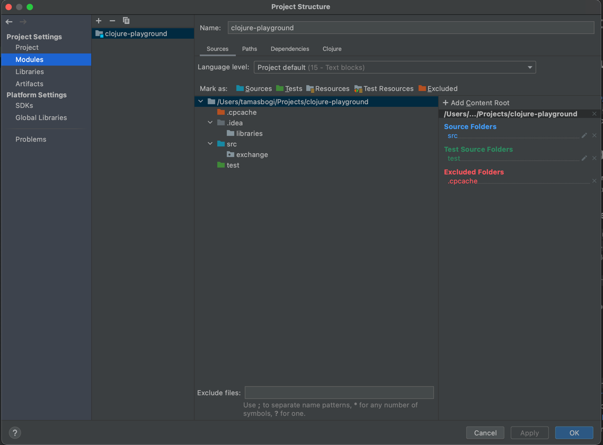
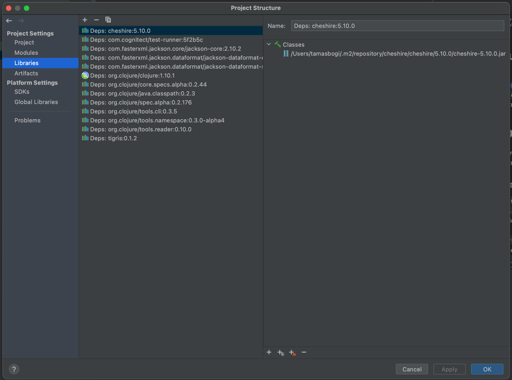
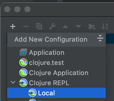
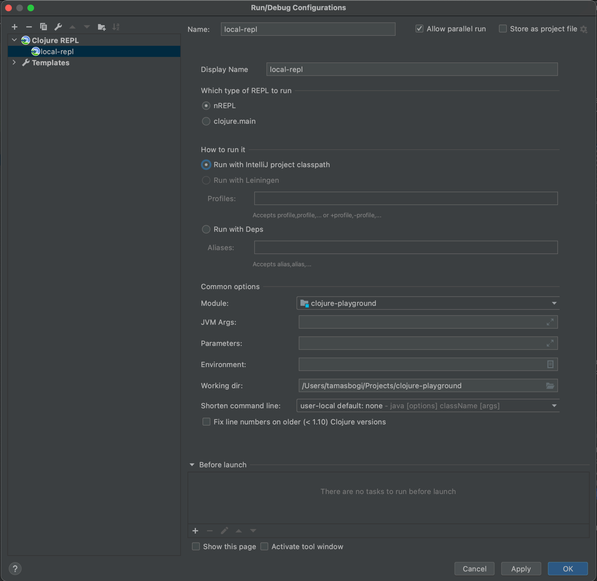
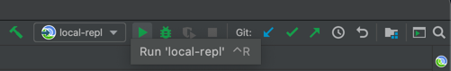
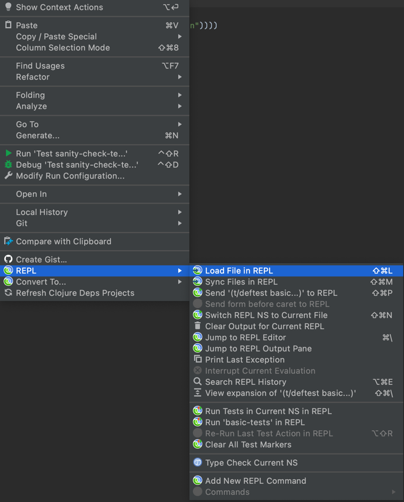

# Getting started

## Bare minimum
- clone this project (or if you want more magic create-react-app like framework have a look at [luminus](https://luminusweb.com))
- install JDK and [clojure cli tools](https://clojure.org/guides/getting_started)
- run `clj -Msanity`
  - clj should download any necessary dependencies now and run the short script
  - if you see "Good job!" you are ready
  
## Choice of IDE
- subjectively preferred: [Idea](https://www.jetbrains.com/idea/) + [Cursive](https://cursive-ide.com)
- alternative I have tried: [VScode](https://code.visualstudio.com) + [Calva](https://marketplace.visualstudio.com/items?itemName=betterthantomorrow.calva) 

### If you go with Idea+Cursive
- `File > New > Project from Existing Source`
- choose the `deps.edn` in the repo
- next next next... (defaults should be good) but choose up to date JDK (at writing used 15)
- check `File > Project Structure` to make sure
  - should have set `Sources` and `Tests` paths
  
  - libraries are correctly downloaded and resolved
    (you should see probably more, because I'm writing this in the beginning,but most importantly NO LESS,
    and there should be an explicit dependency for clojure version)
  
  - if some of above is not correct there are probably some popups from IDEA which should aid you to download/index/...
- open some `.clj` file and make sure symbols are resolving, if not [troubleshoot](https://cursive-ide.com/userguide/eap/troubleshooting.html#help-lots-of-symbols-don-t-resolve)
- setup and try out REPL
  - `Run > Edit Configurations...`
  
    
  - the default config should be fine, you can play with the options later
    
  - start the REPL
    
  - when started try to write and paste `(+ 1 2)` to the REPL
  - open some `.clj` file and right click on a piece of code
     
    The most important commands you should remember, use and abuse, are:
    - `Load File in REPL` load/eval the file and all its dependencies
    - `Switch REPL NS to Current File` to use the functions without require and or full path
    - `Send ... to REPL` to eval your current selection

### If you go with some alternative
- GL HF

## Useful links and tips
- somewhere to [star](https://clojure.org/guides/deps_and_cli)
- 3rd party, a bit outdated but might have some useful info [more info](https://oli.me.uk/clojure-projects-from-scratch/)
- if you need more [libraries](https://clojars.org)
- your most important resource the [docs](https://clojuredocs.org)
- run (look in `deps.edn` for the magic):
  - `clj -Msanity` to make sure you have the bare minimum working
  - `clj -Mtest` to run tests
  - `clj -Mexchange` to run the project
- most of your REPL problems will be from forgetting to LOAD some file or being in incorrect namespace
- startup times are long, for development start the code from the REPL
  - the REPL by default starts in namespace `user` use this to your advantage, add helpers there
  - start with `(start-app)`
  - router is set to hot-reload with middleware
  - for changes in other files reloading the file in REPL should be enough
- logging is not straightforward, if it has some problems for you, just live with it / use println / or try to fix it, but you might skip this until necessary
  - how it ["works"](https://lambdaisland.com/blog/2020-06-12-logging-in-clojure-making-sense-of-the-mess)
  - some simple default [setup](https://clojureverse.org/t/how-do-you-personally-do-logging/4299/4)
  - this project uses [timbre](https://github.com/ptaoussanis/timbre)
  